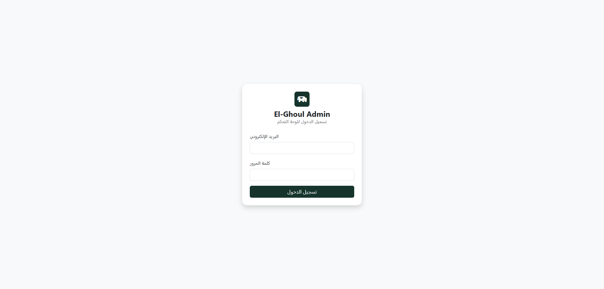
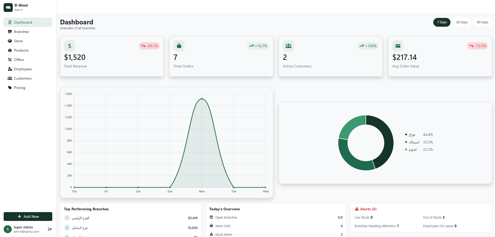
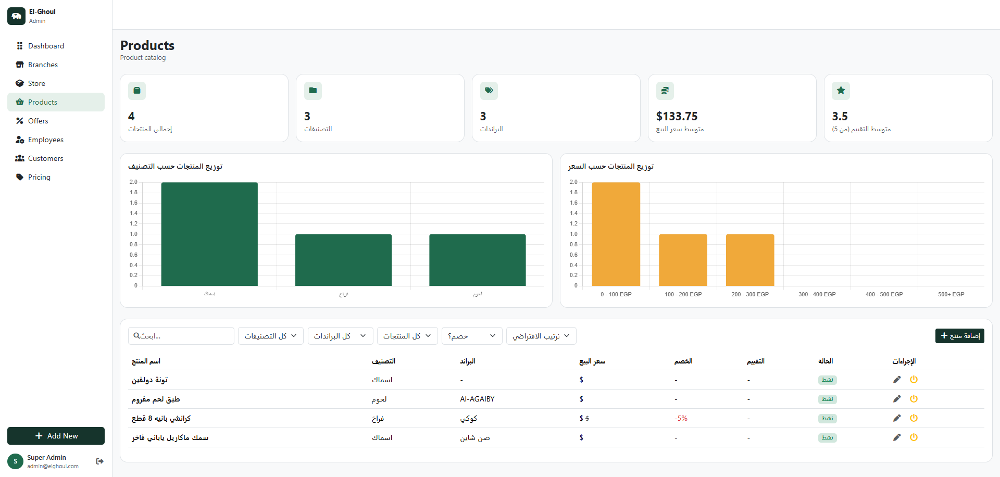
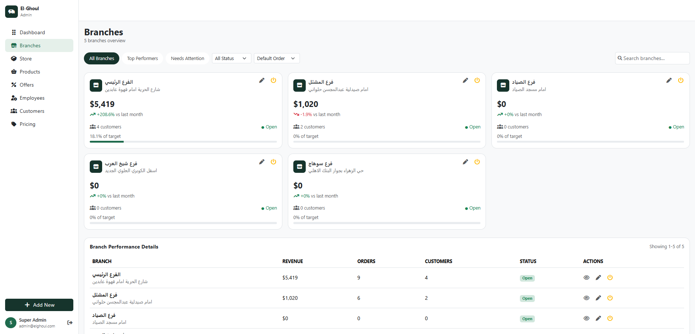

# Alghoul Admin Dashboard

A modern admin dashboard for managing the Alghoul system.

Built with **React** and **Vite**, the dashboard provides a centralized interface for managing products, offers, branches, inventory, pricing, employees, and customers, with authenticated access and backend API integration.

---

## 🚀 Features

* 🔐 Admin authentication and protected routes
* 📊 Dashboard statistics and charts
* 🏪 Branch management
* 📦 Product management
* 🏷️ Offers management
* 💰 Pricing management
* 📋 Inventory and stock management
* 👥 Customer management
* 👨‍💼 Employee management
* 🔄 API-based data synchronization
* 🧩 Reusable components, forms, and modals
* 📱 Responsive dashboard interface

---

## 🛠️ Tech Stack

* **React 19**
* **Vite**
* **React Router DOM**
* **Axios**
* **React Context API**
* **Chart.js**
* **Bootstrap 5**
* **Font Awesome 6**
* **OXLint**

---

## 📸 Screenshots

### Login



### Dashboard



### Products



### Branches



> Add your project screenshots inside a `screenshots` folder in the project root and update the file names above when needed.

---

## 📁 Project Structure

```text
src/
│
├── components/
│   ├── forms/
│   ├── AddNewModal.jsx
│   ├── Layout.jsx
│   ├── Sidebar.jsx
│   ├── ProtectedRoute.jsx
│   └── ...
│
├── context/
│   ├── AuthContext.jsx
│   ├── BranchesContext.jsx
│   ├── BrandsContext.jsx
│   ├── CategoriesContext.jsx
│   ├── CustomersContext.jsx
│   ├── EmployeesContext.jsx
│   ├── InventoryContext.jsx
│   ├── ModalContext.jsx
│   ├── OffersContext.jsx
│   ├── PricingContext.jsx
│   └── ProductsContext.jsx
│
├── data/
│   ├── api.js
│   ├── apiClient.js
│   └── ...
│
├── pages/
│   ├── Login.jsx
│   ├── Dashboard.jsx
│   ├── Branches.jsx
│   ├── BranchDetail.jsx
│   ├── Store.jsx
│   ├── Products.jsx
│   ├── Offers.jsx
│   ├── Pricing.jsx
│   ├── Employees.jsx
│   └── Customers.jsx
│
├── App.jsx
├── main.jsx
└── index.css
```

---

## ⚙️ Getting Started

### Prerequisites

Make sure you have installed:

* [Node.js](https://nodejs.org/)
* npm
* Git

### Installation

Clone the repository:

```bash
git clone https://github.com/shahendamohamed22/alghoul-dashboard.git
```

Navigate to the project:

```bash
cd alghoul-dashboard
```

Install dependencies:

```bash
npm install
```

Start the development server:

```bash
npm run dev
```

The application will normally be available at:

```text
http://localhost:5173
```

---

## 📜 Available Scripts

### Start development server

```bash
npm run dev
```

### Build for production

```bash
npm run build
```

The production files are generated inside:

```text
dist/
```

### Preview production build

```bash
npm run preview
```

### Run linting

```bash
npm run lint
```

---

## 🔐 Authentication

The dashboard uses an admin authentication flow with protected routes.

Authentication is handled through:

```text
src/context/AuthContext.jsx
```

Protected pages are handled through:

```text
src/components/ProtectedRoute.jsx
```

The authenticated admin token is used when communicating with protected backend endpoints.

---

## 🔌 API Integration

The dashboard communicates with the backend API using **Axios**.

API configuration:

```text
src/data/api.js
```

Shared Axios client:

```text
src/data/apiClient.js
```

Domain-specific API operations are organized inside their corresponding Context.

For example:

```text
ProductsContext
OffersContext
InventoryContext
PricingContext
BranchesContext
EmployeesContext
CustomersContext
```

This keeps API logic and shared state centralized instead of duplicating requests across components.

---

## 🧠 State Management

The project uses the **React Context API** for shared application state.

Main contexts include:

| Context             | Responsibility                   |
| ------------------- | -------------------------------- |
| `AuthContext`       | Authentication and admin session |
| `BranchesContext`   | Branch data and operations       |
| `ProductsContext`   | Product data and operations      |
| `OffersContext`     | Offers management                |
| `InventoryContext`  | Stock and inventory operations   |
| `PricingContext`    | Pricing operations               |
| `CustomersContext`  | Customer data                    |
| `EmployeesContext`  | Employee data                    |
| `ModalContext`      | Shared modal state               |
| `BrandsContext`     | Brand data                       |
| `CategoriesContext` | Category data                    |

---

## 🧩 Reusable Components

The dashboard uses reusable components to keep the UI consistent and easier to maintain.

Examples include:

* `Layout`
* `Sidebar`
* `ProtectedRoute`
* `FilterBar`
* `StatCard`
* `ChartCanvas`
* `AddNewModal`
* `EditPriceModal`
* `OfferProductsModal`
* `StockHistoryModal`
* `TransferStockModal`

Forms are organized inside:

```text
src/components/forms/
```

---

## 🔄 Application Flow

The main application flow can be summarized as:

```text
Admin
  ↓
Login
  ↓
AuthContext
  ↓
ProtectedRoute
  ↓
Dashboard Layout
  ↓
Pages
  ↓
Context
  ↓
Axios API Client
  ↓
Backend API
```

---

## 🌐 Main Routes

| Route           | Description                  |
| --------------- | ---------------------------- |
| `/login`        | Admin login                  |
| `/`             | Dashboard                    |
| `/branches`     | Branch management            |
| `/branches/:id` | Branch details               |
| `/store`        | Inventory / store management |
| `/employees`    | Employee management          |
| `/customers`    | Customer management          |
| `/pricing`      | Pricing management           |
| `/offers`       | Offers management            |
| `/products`     | Product management           |

---

## 🏗️ Production Build

To create a production-ready build:

```bash
npm run build
```

Vite generates the optimized application inside:

```text
dist/
```

This folder can then be deployed to your hosting platform.

---

## 📖 Documentation

For the complete developer documentation, including:

* Project architecture
* Authentication flow
* Routing
* Contexts
* API integration
* Forms and modals
* CRUD operations
* Error handling
* Debugging
* Adding new features
* Development workflow
* Deployment
* Security considerations

See:

👉 **[DOCUMENTATION.md](./DOCUMENTATION.md)**

---

## 🔒 Security

Do not commit sensitive information such as:

* Passwords
* JWT tokens
* API keys
* Private credentials

Authentication credentials should always be handled securely and should never be hard-coded into the source code.

---

## 👩‍💻 Developer

**Shahenda Mohamed**

Frontend Developer

GitHub: [@shahendamohamed22](https://github.com/shahendamohamed22)

---

## 📂 Repository

[Alghoul Admin Dashboard](https://github.com/shahendamohamed22/alghoul-dashboard)
